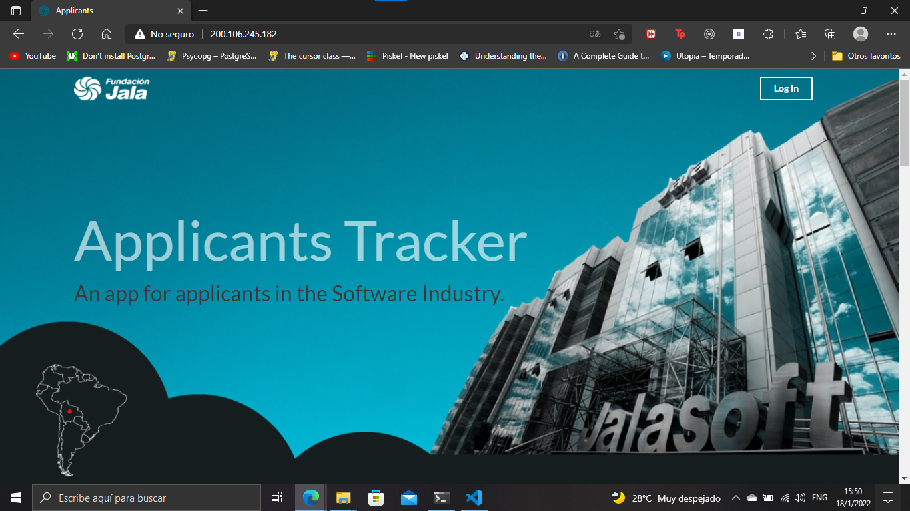

# Applicant Tracker WebApp



<br>

The Web App client for the Applicants Tracker (Tracking Tool) system.

## Services: 

The webApp has two services:
1. **Request service**: This service makes requests to the different APIs.

2. **Logger service**: This service is responsible for making logs of different operations inside the application.

## Technologies involved:

* Html
* Css
* Javascript
* React
* Semantic UI
* Jest
* eslint
* Prettier
* Immer
* React Dropzone
* React Intl
* Winston
* React Beautiful dnd
* React Chart Js 2
* React Export Excel 
* React CSV

## Environment requirements:

This application has two types of dependencies: node packages and backend applications with with the necessary services.

1. **Node packages** Refer to `package.json` file
    
    To run the application correctly, all npm dependencies must be installed with their respective versions.

    You can install all dependencies easily with the next command:

    ```
    npm install
    ```
    or
    ```
    yarn install
    ```

### 1. **Backend Applications**:

- **tracking-tool-applicant-tracking** application is required.

In the following link you can find the application with its instructions to make it run:

https://gitlab.com/fundacionjala/tracking-tool-applicant-tracking

- **tracking-tool-backend-cqrs** application is required.

In the following link you can find the application with its instructions to make it run:

https://gitlab.com/fundacionjala/tracking-tool-backend-cqrs

- **tracking-tool-backend** is required.
In the following link you can find the application with its instructions to make it run:

https://gitlab.com/fundacionjala/tracking-tool-backend

- **tracking-tool-api-applicants-candidates** is required.
In the following link you can find the application with its instructions to make it run:

https://gitlab.com/fundacionjala/tracking-tool-api-applicants-candidates

### 2. **How run the Application locally with Json-Server**:
You can run the application with some endpoints mocked, with the next command:

    cd db
    node backend.js
    cd..
    yarn start

Json Server, has some endpoints mocked from CQRS and identity-service such as:
- /api/v1/authentication/login
- /api/v1/authentication/logout
- /api/v1/users/profile
- /api/v1/program-versions/allStatus
- /api/v1/program-versions/programs
- /api/v1/program-versions/status
- /api/v1/program-versions
- /api/v1/applicants-types
- /api/v1/status-type
- /api/v1/scholars
### 3. **Api**: 
To use the api, you have to create a model with the controller url and enable the following verbs as you needed:
- getAll
- getAllWithParams
- getSingle
- post
- put
- patch
- deleteSingle
### 4. **Settings**:
this file contains the necessary configurations to set the endpoints to the following environments: 
- Development
- ENV
- UAT
## UserGuide:
The user guide was implemented by DrExplain.
For more details about its implementation, go to the following link:
https://jalafoundation.sharepoint.com/:f:/s/Dev33/Ep_9lKjM2N5Oh-c79d8hMPEBC9td6u6a4NjH_U_mLHJsVg?e=7H0ta2
To view the file you need to login with your jala foundation account.
<br>
<br>
